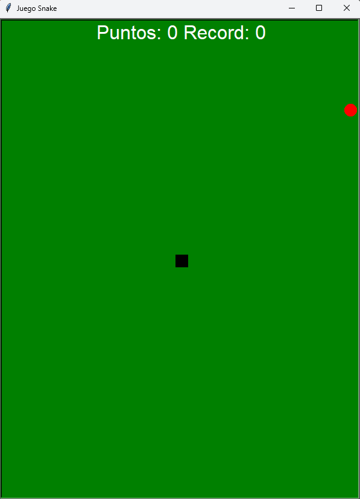

# Snake Game

El programa trata de una recreación del videojuego clásico Snake.
## Instalación

En el caso de este repositorio no es necesario llevar a cabo ninguna instalación en el caso de que solo de descargue el archivo .exe,
en caso contrario si desea descargar el programa en formato .py, únicamente se requiere tener instalado Python en el equipo.

Instalar Python en caso de que no lo tenga:

[Download Python](https://www.python.org/downloads/)

## Funcionalidades

- **Interfaz intuitiva**: El juego presenta una interfaz clara que permite al usuario diferenciar con claridad los diferentes elementos, como la serpiente, el cuerpo de la propia serpiente y las manzanas rojas a comer.

- **Registro de puntuaciones record**: El juego permite registrar la puntuación máxima obtenida teniendo en cuenta todas las partidas jugadas tras abrir el programa.

- **Fácil y rápido**: No requiere ningún tipo de instalación adicional, basta con descargar el fichero .exe y ejecutarlo para así empezar a jugar.

- **Obtención de puntos**: Los puntos se obtienen a base de comer manzanas rojas, representadas en la interfaz como circulos rojos, cada vez que la serpiente come una manzana su cuerpo crecerá y sumará 10 puntos al marcador.

- **Sin límite de puntos**: Las partidas son prácticamente infinitas, todo depende de la habilidad del usuario a la hora de controlar la serpiente.

- **Dificultad**: Puede ocurrir que a lo largo de la partida una manzana aparezca en los bordes de la ventana, siendo así el límite del espacio disponible para poder mover la serpiente, si te pasas un poco acabará la partida.

## Screenshots

## Desarrollo

Ambos programas presentados se encuentran desarrollados en **Python**, uno en formato .py, y el otro exportado a .exe mediante pyinstaller.
